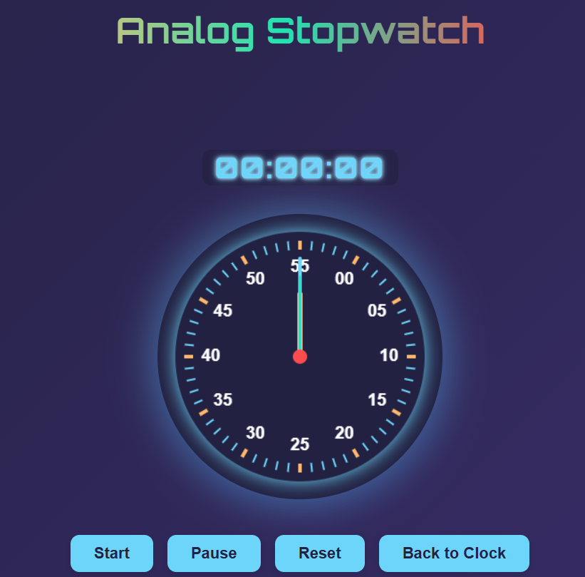
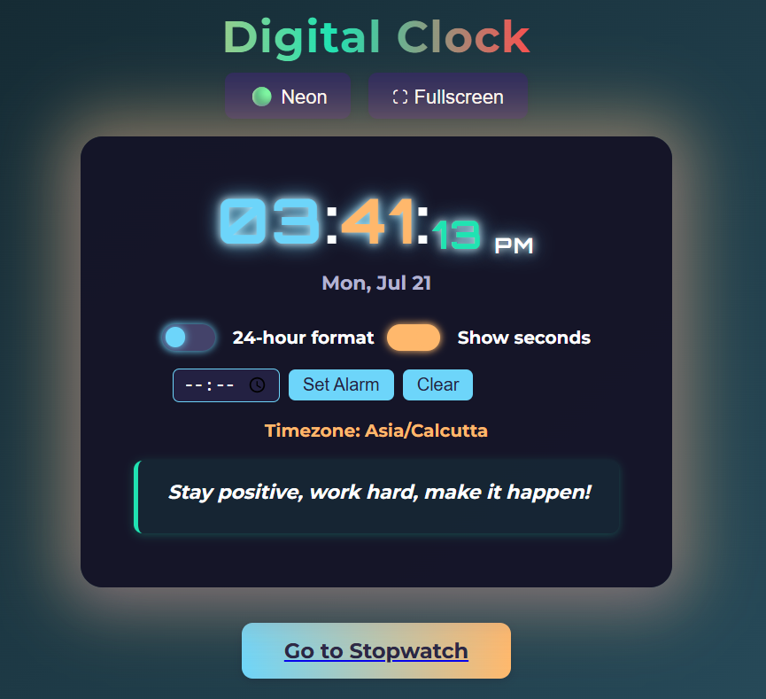

# Digital Clock: Precision & Aesthetics ⏰✨

A modern, aesthetic digital clock web application that prioritizes both visual appeal and **uncompromising time accuracy**. Inspired by the sleek designs of Coding Snow, this project integrates a responsive frontend with a robust **C backend for precise time synchronization**, offering a unique blend of web elegance and low-level precision.

## 🚀 Live Demo

Experience the clock in action:

## ✨ Features

* **Beautiful, Glowing Digital UI:** A clean, modern interface with a subtle glowing effect, ensuring excellent readability day or night.
* **12/24-Hour Format Switch:** Effortlessly toggle between standard 12-hour (AM/PM) and military 24-hour time formats.
* **Dynamic Date Display:** Always shows the current date alongside the precise time.
* **C-Powered Time Accuracy:** Leverages a custom C program as a backend for time calculation, ensuring high precision and reliability, independent of typical browser-based timing quirks.
* **Modular Design:** Separated concerns with dedicated files for HTML structure, CSS styling, and JavaScript logic, making it easy to understand and extend.

## 📸 Screenshots

See the digital clock in action:

| **StopWatch** | **12-Hour Format** |
| :----------------: | :----------------: |
|  |  |

## 📂 Project Structure

Digital Clock/
├── index.html          # The main HTML file defining the structure of the web clock.
├── style.css           # Contains all CSS for the clock's visual design, including glowing effects.
├── script.js           # Frontend JavaScript for UI updates, date/time formatting, and format switching.
├── clock_server.c      # The C source code for the time backend, responsible for accurate time retrieval.
├── clock_server        # The compiled executable of the C clock server (e.g., clock_server.exe on Windows).
├── bridge.js           # JavaScript module handling communication between the frontend and the C backend.
├── README.md           # This project documentation file.

├── stopwatch.html      # (Optional) HTML for a standalone stopwatch component/page.
├── stopwatch.css       # (Optional) Stylesheet specifically for the stopwatch component.
├── stopwatch.js        # (Optional) JavaScript logic for the stopwatch functionality.